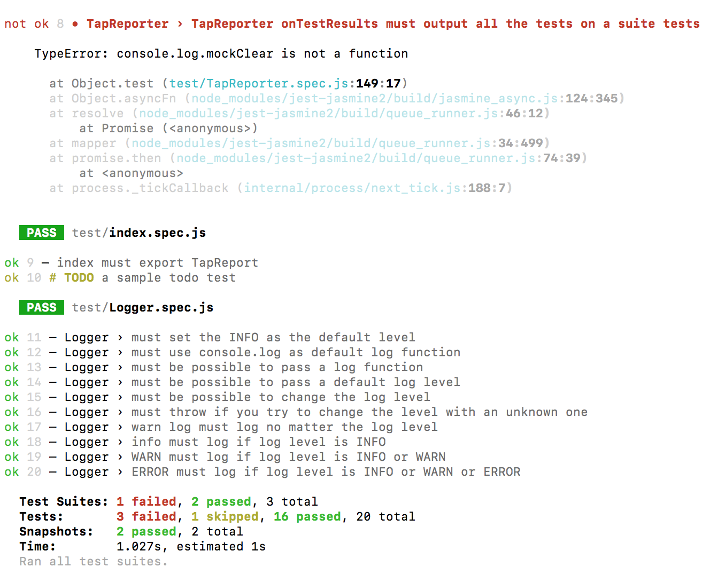

# jest-tap-reporter

[travis-badge]: https://api.travis-ci.org/MailOnline/jest-tap-reporter.svg?branch=master
[travis]: https://travis-ci.org/MailOnline/jest-tap-reporter
[npm-badge]: https://img.shields.io/npm/v/jest-tap-reporter.svg
[npm]: https://www.npmjs.com/package/jest-tap-reporter
[license-badge]: https://img.shields.io/badge/license-MIT-green.svg

[![jest-tap-reporter on NPM][npm-badge]][npm] [![Travis CI][travis-badge]][travis] ![License][license-badge]

Jest reporter that outputs valid [TAP](https://testanything.org/tap-specification.html) output and highlights similar to Jest's default reporter.



## Installation

#### yarn
```shell
yarn add --dev jest-tap-reporter
```

#### npm
```shell
npm install --dev jest-tap-reporter
```

## Usage

#### Add to your jest configuration

```javascript
{
  "reporters": [
    "jest-tap-reporter"
  ]
}
```

#### Log levels

By default jest-tap-reporter will log the suite path and a resume at the end of the report. If you reduce the report to the bare minimum you can set the reporter logLevel to error.

```javascript
{
  "reporters": [
    ["jest-tap-reporter", {"logLevel": "ERROR"}]
  ]
}
```

Available log levels are: `ERROR`, `WARN`, `INFO`.